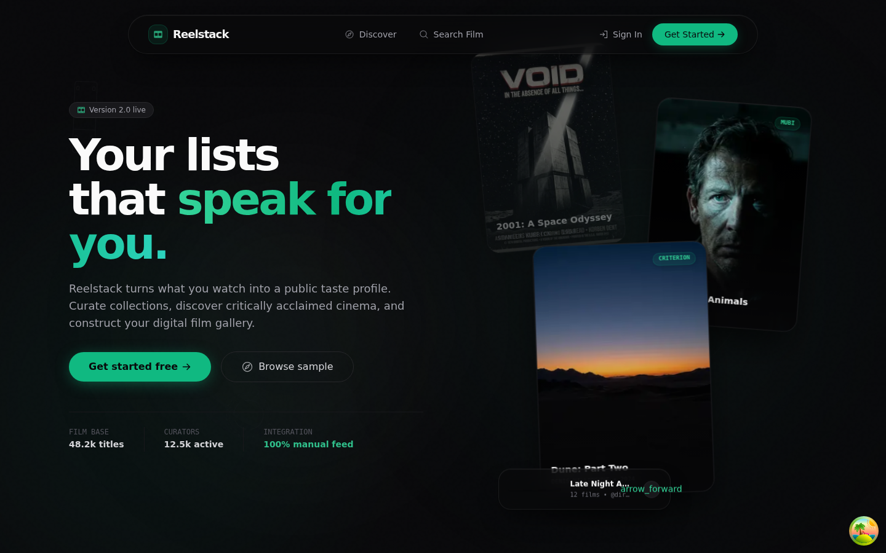
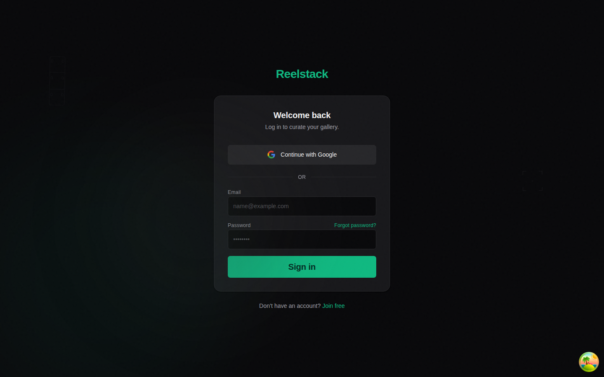
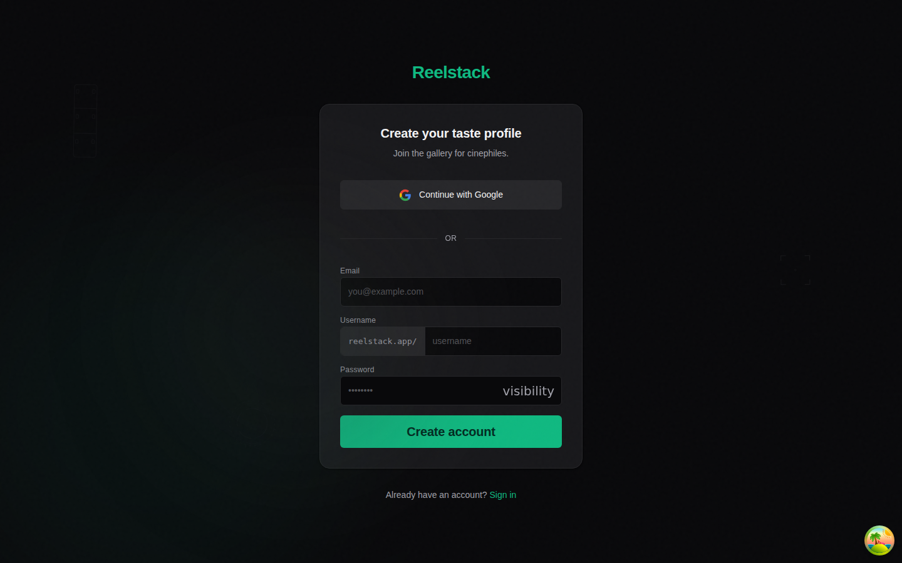

# Reelstack

> Your film taste, publicly yours.

A social film/TV watchlist platform — think Spotify for your movie taste. Search any title, see which streaming services have it, save it to a list, share your list publicly.

## Screenshots

| Landing | Sign in | Create account |
|---|---|---|
|  |  |  |

## Stack

| Layer | Tech |
|-------|------|
| Backend API | Go + Fiber |
| Database | PostgreSQL (Neon in prod) |
| Cache | Redis (Upstash in prod) |
| Frontend | Next.js 14 (App Router) |
| Styling | Tailwind CSS |
| Deploy | Railway (API) + Vercel (Web) |

## Quick start

```bash
# 1. Copy env files
cp .env.example .env
cp apps/api/.env.example apps/api/.env
cp apps/web/.env.example apps/web/.env

# 2. Start infrastructure
make docker-up

# 3. Install frontend deps
pnpm install

# 4. Run everything
make dev
```

API runs at http://localhost:8080  
Web runs at http://localhost:3000  


## Project structure

```
reelstack/
├── apps/
│   ├── api/          # Go backend
│   └── web/          # Next.js frontend
├── docs/decisions/   # Architecture decision records
├── docker-compose.yml
└── Makefile
```

## Scripts

| Command | Does |
|---------|------|
| `make dev` | Starts docker + api + web |
| `make test-api` | Go tests with race detector |
| `make migrate` | Runs DB migrations |
| `make lint` | go vet + eslint |
| `make build-api` | Produces linux/amd64 binary |

## Curator Reputation Score

Each user has a reputation score (0–1000) based on four weighted dimensions:

| Dimension | Max | Formula |
|-----------|-----|---------|
| Follower Score | 250 | min(250, followers × 5) |
| Saves Score | 250 | min(250, list saves × 10) |
| Creation Score | 250 | min(250, public lists × 20 + public items × 2) |
| Activity Score | 250 | Tier-based: 7d→250, 30d→200, 90d→150, 180d→100, 365d→50 |

### How it works

1. A **materialized view** (`curator_scores`) is refreshed every 6 hours via cron
2. The cron endpoint `POST /api/v1/cron/scores` requires `X-Cron-Secret` header
3. Score is embedded in profile responses (no separate API call)
4. Leaderboard available at `GET /api/v1/curators/leaderboard`

### Configuration

Set `CRON_SECRET` in your environment to secure the cron endpoint:

```bash
CRON_SECRET=your-secret-here
```

Schedule the cron job (e.g., every 6 hours):

```bash
curl -X POST https://your-api.com/api/v1/cron/scores \
  -H "X-Cron-Secret: your-secret-here"
```

### Score Tiers

| Range | Badge |
|-------|-------|
| 800–1000 | Master Curator (amber) |
| 600–799 | Expert Curator (emerald) |
| 400–599 | Curator (teal) |
| 200–399 | Rising Curator (sky) |
| 0–199 | Newcomer (zinc) |
