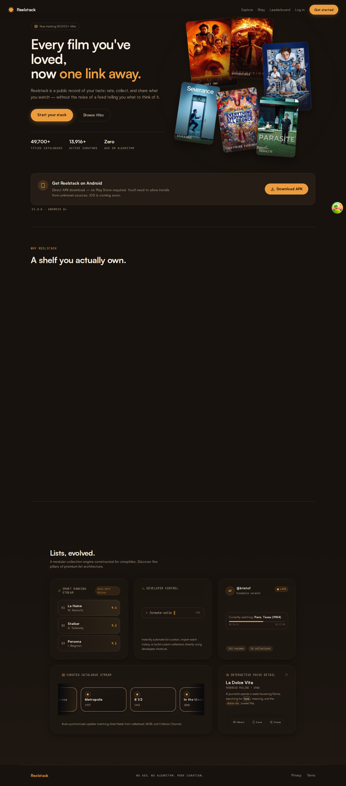
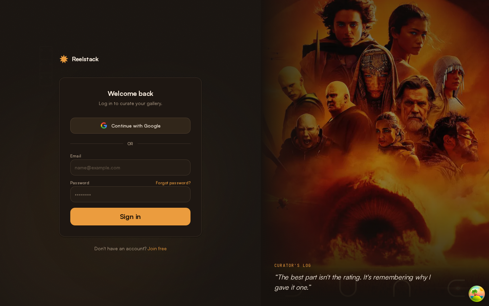
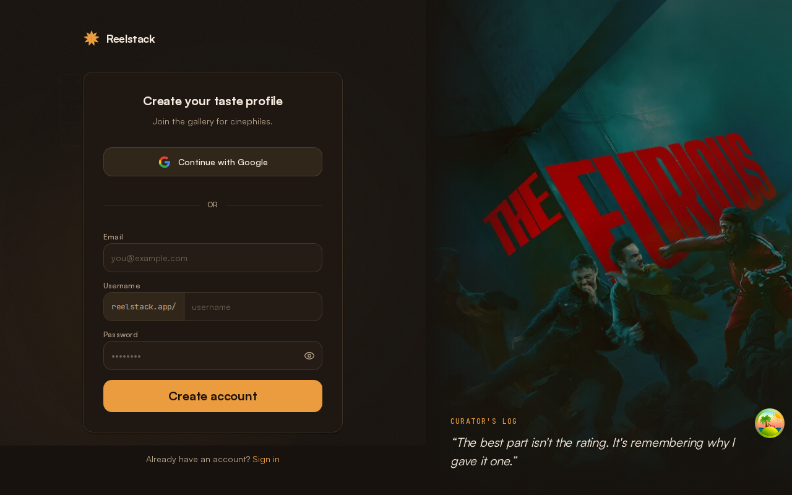
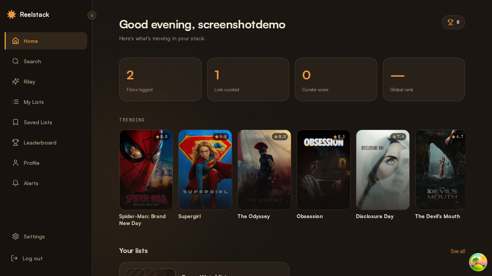
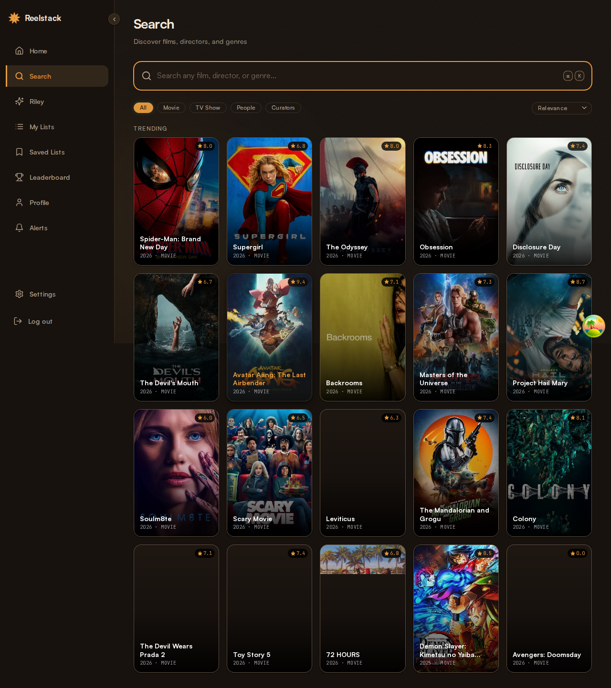
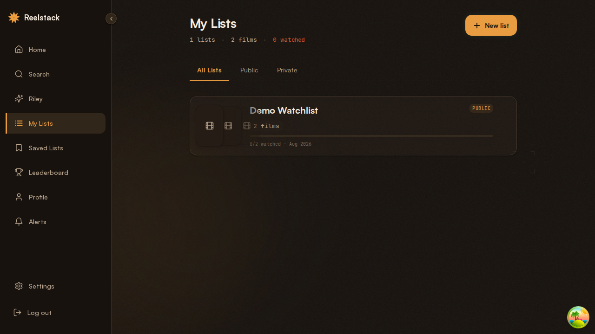
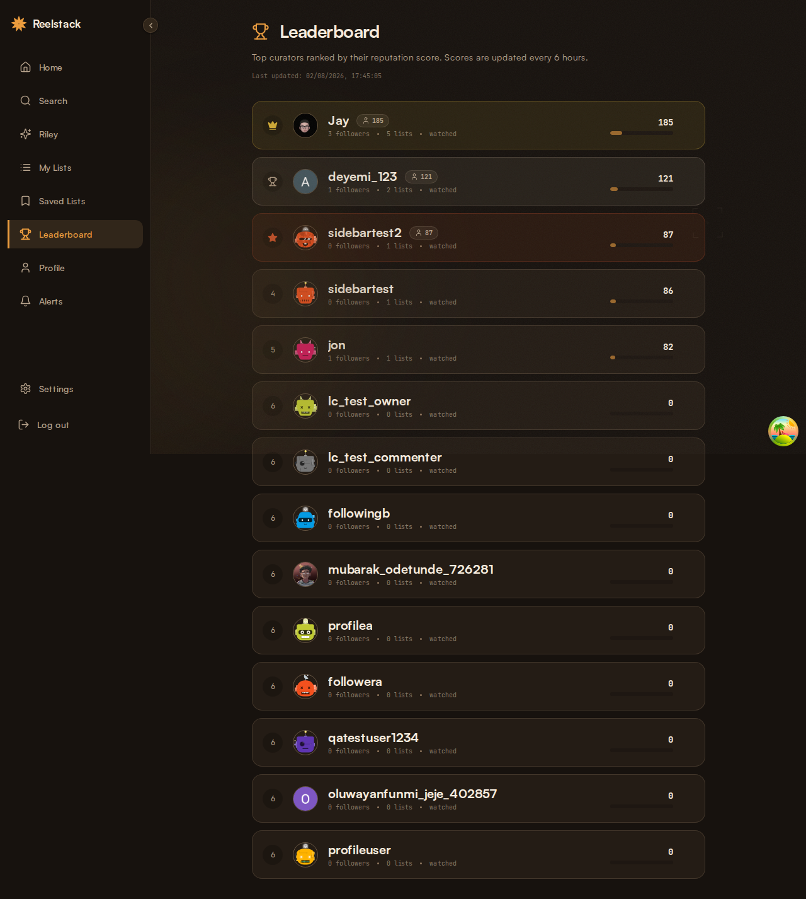

# Reelstack

> Your film taste, publicly yours.

A social film/TV watchlist platform — think Spotify for your movie taste. Search any title, see which streaming services have it, save it to a list, share your list publicly.

## Screenshots

| Landing | Sign in | Create account |
|---|---|---|
|  |  |  |

| Dashboard | Search | Lists | Leaderboard |
|-----------|--------|-------|-------------|
|  |  |  |  |

## Stack

| Layer | Tech |
|-------|------|
| Backend API | Go + Fiber |
| Database | PostgreSQL (Neon in prod) |
| Cache | Redis (Upstash in prod) |
| Frontend | Next.js 14 (App Router) |
| Styling | Tailwind CSS |
| Deploy | Railway (API) + Vercel (Web) |

## Quick start

```bash
# 1. Copy env files
cp .env.example .env
cp apps/api/.env.example apps/api/.env
cp apps/web/.env.example apps/web/.env

# 2. Start infrastructure
make docker-up

# 3. Install frontend deps
pnpm install

# 4. Run everything
make dev
```

API runs at http://localhost:8080  
Web runs at http://localhost:3000  


## Project structure

```
reelstack/
├── apps/
│   ├── api/          # Go backend
│   └── web/          # Next.js frontend
├── docs/decisions/   # Architecture decision records
├── docker-compose.yml
└── Makefile
```

## Scripts

| Command | Does |
|---------|------|
| `make dev` | Starts docker + api + web |
| `make test-api` | Go tests with race detector |
| `make migrate` | Runs DB migrations |
| `make lint` | go vet + eslint |
| `make build-api` | Produces linux/amd64 binary |

## Riley — AI movie agent

Riley is Reelstack's in-app AI agent: a movie-news digest summarized from free RSS feeds (Variety, Deadline, THR, /Film, IndieWire), "Top Movies/Series Right Now" rails from TMDB trending, an LLM-curated Top 10 with one-line takes, and a chat companion. Lives at `/riley` in the web app.

### How it works

1. `POST /api/v1/cron/riley` (secured by `X-Cron-Secret`) regenerates everything: RSS → LLM digest, TMDB → top lists, candidates → LLM top-10. Schedule it every ~6 hours (same Railway cron pattern as `/cron/scores`).
2. Artifacts persist in Postgres (`riley_artifacts`) with a 6h Redis read cache.
3. Public reads: `GET /api/v1/riley/digest`, `GET /api/v1/riley/top`. Chat: `POST /api/v1/riley/chat` (JWT required).
4. Chat budgets: **3/min and 10/day per user** (abuse control), **20/min and 200/day globally** (a coarse backstop). Provider capacity is handled separately by the LLM gateway below. Constants live in `internal/riley/service.go`.

### Configuration — the LLM gateway

Riley talks to LLMs through a gateway (`pkg/llm`) that tries providers in **strict priority order and fails over** on rate limits or errors. Pooling several free tiers is what keeps Riley usable: any single one runs out quickly on its own.

```bash
GROQ_API_KEY=         # tried first (fastest)
OPENROUTER_API_KEY=   # tried when Groq is rate-limited or erroring
GEMINI_API_KEY=       # last resort
```

Every key is optional; set as many as you have. With none set, the digest and chat are disabled (routes return 503) and the top lists still work. The legacy single-provider `LLM_API_KEY` / `LLM_BASE_URL` / `LLM_MODEL` trio is still honoured when no `*_API_KEY` above is set, so existing deployments keep working unchanged.

Base URLs, default models, and free-tier quota ceilings ship as built-in defaults in `pkg/llm/provider.go`. Override per provider only when needed:

```bash
LLM_PROVIDER_ORDER=groq,openrouter,gemini   # change priority
GROQ_MODEL=...  GROQ_BASE_URL=...           # per-provider overrides
GROQ_RPM=  GROQ_RPD=  GROQ_TPM=  GROQ_TPD=  # per-provider quota ceilings
```

Per-provider request and token spend is tracked in Redis, so a provider known to be out of quota is **skipped before dispatch** rather than burning a request to rediscover a 429. When every provider is genuinely spent, chat returns 503 with a `Retry-After`. See `docs/decisions/002-llm-gateway.md`.

## Curator Reputation Score

Each user has a reputation score (0–1000) based on four weighted dimensions:

| Dimension | Max | Formula |
|-----------|-----|---------|
| Follower Score | 250 | min(250, followers × 5) |
| Saves Score | 250 | min(250, list saves × 10) |
| Creation Score | 250 | min(250, public lists × 20 + public items × 2) |
| Activity Score | 250 | Tier-based: 7d→250, 30d→200, 90d→150, 180d→100, 365d→50 |

### How it works

1. A **materialized view** (`curator_scores`) is refreshed every 6 hours via cron
2. The cron endpoint `POST /api/v1/cron/scores` requires `X-Cron-Secret` header
3. Score is embedded in profile responses (no separate API call)
4. Leaderboard available at `GET /api/v1/curators/leaderboard`

### Configuration

Set `CRON_SECRET` in your environment to secure the cron endpoint:

```bash
CRON_SECRET=your-secret-here
```

Schedule the cron job (e.g., every 6 hours):

```bash
curl -X POST https://your-api.com/api/v1/cron/scores \
  -H "X-Cron-Secret: your-secret-here"
```

### Score Tiers

| Range | Badge |
|-------|-------|
| 800–1000 | Master Curator (amber) |
| 600–799 | Expert Curator (emerald) |
| 400–599 | Curator (teal) |
| 200–399 | Rising Curator (sky) |
| 0–199 | Newcomer (zinc) |
